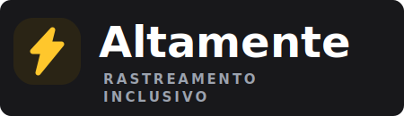

<a name="readme-top"></a>

<div align="center">
  
  [![Contributors][contributors-shield]][contributors-url]
  [![Forks][forks-shield]][forks-url]
  [![Stargazers][stars-shield]][stars-url]
  [![Issues][issues-shield]][issues-url]
  [![MIT License][license-shield]][license-url]
  
</div>
<br />
<div align="center">
  <a href="https://github.com/voaneves/altamente">
        
  </a>
  <p align="center">
    Aplicativo de Rastreamento de Habilidades para educação inclusiva, conectando profissionais e famílias.
    <br />
    <a href="https://github.com/voaneves/altamente"><strong>Explore o código-fonte »</strong></a>
    <br />
    <br />
    <a href="https://voaneves.com/altamente"><strong>Visite o App »</strong></a>
    <br>
    <a href="https://github.com/voaneves/altamente/issues">Reporte um Bug</a>
    ·
    <a href="https://github.com/voaneves/altamente/issues">Sugira uma Funcionalidade</a>
  </p>
</div>

<details>
  <summary>Índice</summary>
  <ol>
    <li>
      <a href="#sobre-o-projeto">Sobre o Projeto</a>
      <ul>
        <li><a href="#tecnologias-utilizadas">Tecnologias Utilizadas</a></li>
      </ul>
    </li>
    <li><a href="#funcionalidades-principais">Funcionalidades Principais</a></li>
    <li><a href="#como-começar">Como Começar</a></li>
    <li><a href="#processo-de-deploy">Processo de Deploy</a></li>
    <li><a href="#contribuindo">Contribuindo</a></li>
    <li><a href="#licença">Licença</a></li>
    <li><a href="#contato">Contato</a></li>
    <li><a href="#agradecimentos">Agradecimentos</a></li>
  </ol>
</details>

## Sobre o Projeto

O **Altamente** é um aplicativo voltado para a educação inclusiva, desenvolvido para facilitar o acompanhamento do desenvolvimento infantil. Ele permite o rastreamento contínuo de habilidades essenciais, como Interação Social, Foco e Atenção, Coordenação Motora, Comunicação Expressiva e Regulação Emocional.

O sistema foi desenhado para aproximar profissionais (terapeutas, educadores) e famílias, fornecendo dashboards personalizados, relatórios gerados por Inteligência Artificial e sincronização de dados em tempo real.

<div align="center">
  <a href="https://voaneves.com/altamente">
    <!-- Substitua pelo caminho real de uma screenshot do seu app -->
    
  </a>
</div>
<p align="center"><i>Screenshot do painel principal do projeto.</i></p>

<p align="right">(<a href="#readme-top">voltar ao topo</a>)</p>

### Tecnologias Utilizadas

Este projeto foi construído com uma stack moderna, focando em performance, responsividade e experiência "mobile-first" (PWA).

* [![React][React-shield]][React-url]
* [![TypeScript][TypeScript-shield]][TypeScript-url]
* [![TailwindCSS][TailwindCSS.com]][TailwindCSS-url]
* [![Firebase][Firebase-shield]][Firebase-url]
* [![Capacitor][Capacitor-shield]][Capacitor-url]

<p align="right">(<a href="#readme-top">voltar ao topo</a>)</p>

## Funcionalidades Principais

-   **Rastreamento de Habilidades:** Registro diário do nível de sucesso em diversas atividades e habilidades.
-   **Dashboards Baseados em Papéis:** Visões e permissões diferentes para Administradores (profissionais) e Famílias.
-   **Assistente com IA (Gemini):** Geração automática de relatórios de progresso e insights baseados no histórico da criança.
-   **Sincronização em Tempo Real:** Banco de dados Firestore garantindo que as informações estejam sempre atualizadas em todos os dispositivos.
-   **Progressive Web App (PWA):** Instalável no celular ou desktop, oferecendo uma experiência nativa.
-   **Feedback Tátil (Haptics):** Integração com o hardware do dispositivo para respostas físicas a interações (via Capacitor).

<p align="right">(<a href="#readme-top">voltar ao topo</a>)</p>

## Como Começar

Para rodar o projeto localmente em sua máquina, siga os passos abaixo:

1.  Clone o repositório.
    ```sh
    git clone https://github.com/voaneves/altamente.git
    ```
2.  Navegue até o diretório do projeto.
    ```sh
    cd altamente
    ```
3.  Instale as dependências do NPM.
    ```sh
    npm install
    ```
4.  Configure as variáveis de ambiente (Firebase e Gemini API) no arquivo `.env`.
5.  Inicie o servidor de desenvolvimento.
    ```sh
    npm run dev
    ```

<p align="right">(<a href="#readme-top">voltar ao topo</a>)</p>

## Processo de Deploy

O projeto possui integração contínua (CI/CD) configurada via **GitHub Actions**. O deploy é feito automaticamente para o GitHub Pages.

1.  Qualquer *push* para a branch `main` (ou `master`) aciona o workflow.
2.  O GitHub Actions instala as dependências, faz o build otimizado (com code splitting) e publica na branch `gh-pages`.
3.  O aplicativo ficará disponível no link configurado no seu GitHub Pages (ex: `https://voaneves.com/altamente`).

<p align="right">(<a href="#readme-top">voltar ao topo</a>)</p>

## Contribuindo

Contribuições são o que tornam a comunidade de código aberto um lugar incrível para aprender, inspirar e criar. Qualquer contribuição que você fizer será **muito apreciada**.

Se você tiver uma sugestão para melhorar o projeto, por favor, faça um fork do repositório e crie um pull request. Você também pode simplesmente abrir uma issue com a tag "enhancement".
Não se esqueça de dar uma estrela ao projeto! Obrigado!

1.  Faça um Fork do Projeto
2.  Crie sua Feature Branch (`git checkout -b feature/AmazingFeature`)
3.  Faça o Commit de suas alterações (`git commit -m 'Add some AmazingFeature'`)
4.  Faça o Push para a Branch (`git push origin feature/AmazingFeature`)
5.  Abra um Pull Request

<p align="right">(<a href="#readme-top">voltar ao topo</a>)</p>

## Licença

Distribuído sob a Licença MIT. Veja `LICENSE.txt` para mais informações.

<p align="right">(<a href="#readme-top">voltar ao topo</a>)</p>

## Contato

[LinkedIn](https://linkedin.com/in/voaneves) - [Potfolio](https://voaneves.com) - victorneves478@gmail.com

Link do Projeto: [https://github.com/voaneves/altamente](https://github.com/voaneves/altamente)

<p align="right">(<a href="#readme-top">voltar ao topo</a>)</p>

## Agradecimentos

Gostaria de agradecer às seguintes ferramentas e comunidades que tornaram este projeto possível:

* [React](https://react.dev/)
* [Tailwind CSS](https://tailwindcss.com/)
* [Firebase](https://firebase.google.com/)
* [Google Gemini](https://gemini.google.com/)
* [Capacitor](https://capacitorjs.com/)
* [Lucide Icons](https://lucide.dev/)

<p align="right">(<a href="#readme-top">voltar ao topo</a>)</p>

<!-- MARKDOWN LINKS & IMAGES -->
[contributors-shield]: https://img.shields.io/github/contributors/voaneves/altamente.svg?style=for-the-badge
[contributors-url]: https://github.com/voaneves/altamente/graphs/contributors
[forks-shield]: https://img.shields.io/github/forks/voaneves/altamente.svg?style=for-the-badge
[forks-url]: https://github.com/voaneves/altamente/network/members
[stars-shield]: https://img.shields.io/github/stars/voaneves/altamente.svg?style=for-the-badge
[stars-url]: https://github.com/voaneves/altamente/stargazers
[issues-shield]: https://img.shields.io/github/issues/voaneves/altamente.svg?style=for-the-badge
[issues-url]: https://github.com/voaneves/altamente/issues
[license-shield]: https://img.shields.io/github/license/voaneves/altamente.svg?style=for-the-badge
[license-url]: https://github.com/voaneves/altamente/blob/main/LICENSE.txt

[React-shield]: https://img.shields.io/badge/React-20232A?style=for-the-badge&logo=react&logoColor=61DAFB
[React-url]: https://reactjs.org/
[TypeScript-shield]: https://img.shields.io/badge/TypeScript-007ACC?style=for-the-badge&logo=typescript&logoColor=white
[TypeScript-url]: https://www.typescriptlang.org/
[TailwindCSS.com]: https://img.shields.io/badge/Tailwind_CSS-06B6D4?style=for-the-badge&logo=tailwindcss&logoColor=white
[TailwindCSS-url]: https://tailwindcss.com/
[Firebase-shield]: https://img.shields.io/badge/Firebase-FFCA28?style=for-the-badge&logo=firebase&logoColor=black
[Firebase-url]: https://firebase.google.com/
[Capacitor-shield]: https://img.shields.io/badge/Capacitor-119EFF?style=for-the-badge&logo=capacitor&logoColor=white
[Capacitor-url]: https://capacitorjs.com/
